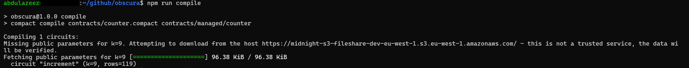
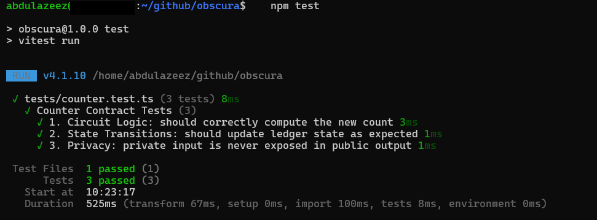
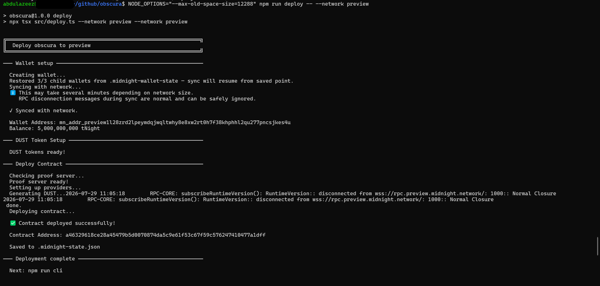

# Obscura

> A privacy-preserving counter smart contract on the Midnight Network that allows users to increment a public counter without revealing the amount they are adding.

## Live Demo

https://obscura-sandy.vercel.app

## Contract Address

| Network | Address                                                            |
| ------- | ------------------------------------------------------------------ |
| Preview | `a46329618ce28a45479b5d0070874da5c9e61f53c67f59c576247410477a1dff` |
| Preprod | _[Will be added after Level 2/3 Preprod deployment]_               |

## What This Does

Obscura is a Zero-Knowledge smart contract that maintains a public `count` on the ledger. Users can call the `increment` circuit to add to this count. The contract proves that the user added a valid, positive amount, but the actual amount remains completely hidden from the public ledger.

## Privacy Model

- **PUBLIC (On-chain, visible to anyone):**
  - The current `count` value stored in the public ledger.
  - The cryptographic hash of the increment value (deliberately disclosed to prove a specific action was taken).
- **PRIVATE (Private witness, NEVER on-chain):**
  - The `secret_increment` amount the user wants to add.
- **PROVED WITHOUT REVEALING:**
  - The user proves they know a `secret_increment` that is strictly greater than zero, and that the new count is the old count plus this secret, without ever revealing the secret itself.

## Privacy Claim

An on-chain observer can see the updated public `count` and the hash of the increment, but they absolutely cannot see the actual `secret_increment` value provided by the user.

## Tech Stack

- Midnight Network
- Compact Language (v0.20+)
- Node.js v22
- Docker (Proof Server)
- Vitest (Testing)

## Prerequisites

- Node.js v22 (Recommended via `nvm`)
- Docker (Running in the background)
- Midnight Compact Compiler installed

## Setup

```bash
# clone
git clone https://github.com/Abdulazeez41/Obscura.git

# folder directory
cd Obscura

npm run compile

# Test
npm test

# Deploy
NODE_OPTIONS="--max-old-space-size=12288" npm run deploy -- --network preview
```

## Demo Video

[PLACEHOLDER — I will add the link after recording]

## Initial Idea

I wanted to build a simple privacy-preserving counter to demonstrate how ZK proofs work on the Midnight Network. The goal was to show that users can update a public value on-chain while keeping the exact amount they added completely private.

## Screenshots

_Compiled_

_Test_

_Deployed_

